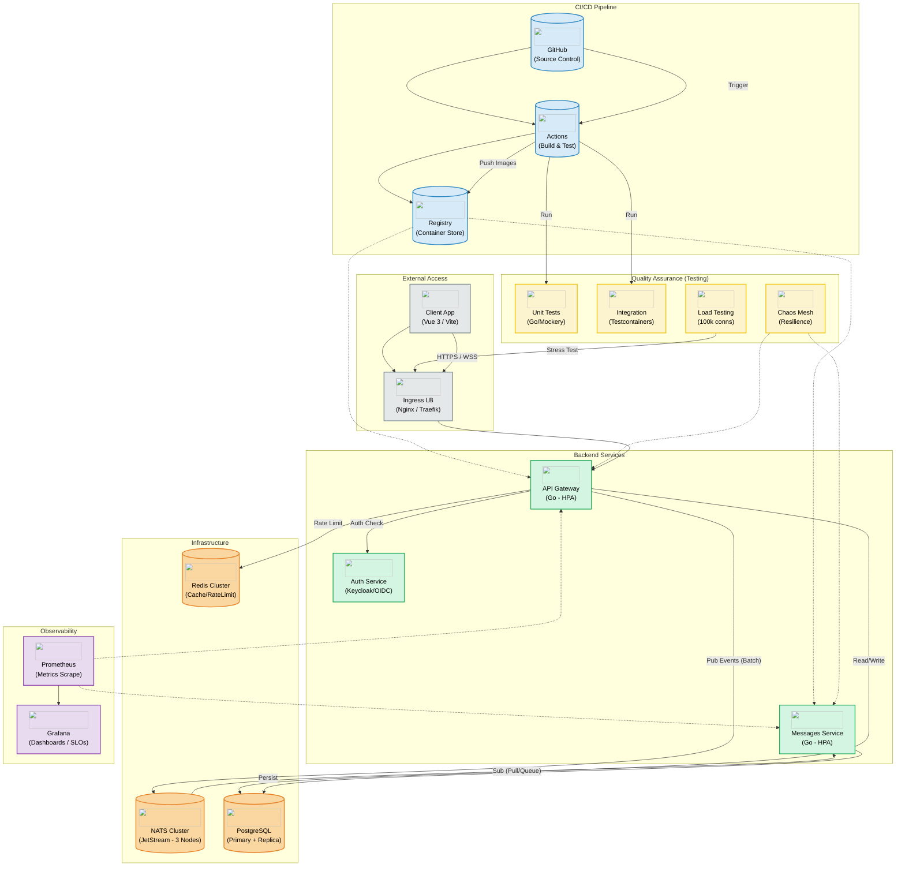

# System Architecture

## Overview
The system follows a microservices architecture using **Go** for backend services, **Vue 3** for the frontend, and **NATS** for event-driven communication. Infrastructure is containerized via Docker and orchestrated (e.g., K8s) for high availability.

## Components

### CI/CD (GitHub)
- **Source Control**: GitHub.
- **CI/CD**: GitHub Actions.
- **Artifacts**: Docker Images stored in GitHub Container Registry (GHCR) or Docker Hub.
- **Workflow**:
    1.  **Push**: Developer pushes code to main/staging branch.
    2.  **Test**: Actions run unit tests and linters.
    3.  **Build**: Actions build Docker images.
    4.  **Deploy**: Updates infrastructure (e.g., via SSH, GitOps, or Webhook).

### Frontend
- **Tech Stack**: Vue 3, Vite, TailwindCSS.
- **Role**: User Interface.
- **Communication**: Talks to the **Gateway** service via HTTPS (REST & WebSocket).

### Backend Services
1.  **Gateway** (`services/gateway`) -> **Autoscaling (HPA)**
    -   **Role**: API Gateway. Entry point for the frontend.
    -   **Responsibilities**: Authentication, routing, aggregation.
    -   **Dependencies**: Postgres, Redis, NATS.
    -   **Scalability**: Stateless service, scales horizontally based on CPU/Memory and active WS connections.

2.  **Messages** (`services/messages`) -> **Autoscaling (HPA)**
    -   **Role**: Event Consumer / specialized service.
    -   **Responsibilities**: Handling message-related logic, listening to `storm.events` on NATS.
    -   **Dependencies**: NATS, Postgres.
    -   **Processing**: Uses JetStream Pull Consumers for backpressure control.

3.  **Auth Service** (Proposed/External)
    -   **Role**: Identity Provider (IdP).
    -   **Tech**: Keycloak, Auth0, or custom Go service issuing JWTs (RS256).

### Infrastructure
-   **NATS JetStream (Cluster)**:
    -   **Role**: Event Bus / Message Broker.
    -   **Configuration**: 3-node cluster for HA and stream replication (R=3).
    -   **Features**: Durable streams, subject partitioning.
-   **PostgreSQL**:
    -   **Role**: Primary Relational Database.
    -   **Usage**: Persistent storage (users, channels, messages).
-   **Redis (Cluster)**:
    -   **Role**: Distributed Cache / Ratelimiter.
    -   **Usage**: Session cache, API rate limiting (Sliding Window), ephemeral state.

### Observability
-   **Prometheus**: Metrics collection (scrape intervals: 15s).
-   **Grafana**: Dashboards (SLO tracking).
-   **Targets (SLOs)**:
    -   **Availability**: 99.9%.
    -   **Latency (p99)**: < 100ms for API calls.
    -   **Throughput**: Support 500k msg/s peak.

## Scalability & Performance Strategy
1.  **Horizontal Pod Autoscaling (HPA)**: Both Gateway and Worker services scale based on load.
2.  **NATS Partitioning**: Message streams partitioned by `channel_id` to distribute load across consumers.
3.  **Batching**: Producers batch messages (up to 1ms or 100 msgs) to reduce syscall overhead.
4.  **Connection Pooling**: Aggressive pooling for Postgres and Redis connections.

## Security
-   **Authentication**: JWT Token passed in headers (Bearer). Validated at Gateway.
-   **Rate Limiting**: Redis-backed limiter per IP/User to prevent abuse/DDoS.
-   **TLS**: All external traffic encrypted (HTTPS/WSS).

## Testing Strategy
To ensure quality (Requirement: >80% coverage) and resilience (Storm Day):
1.  **Unit Logic (Go)**:
    -   Use standard `testing` package + mocks (`mockery`).
    -   Focus on business logic coverage.
2.  **Integration (Testcontainers)**:
    -   Spin up ephemeral NATS/Postgres/Redis for handler testing.
    -   Verify correct message publishing and persistence.
3.  **Load Testing (k6)**:
    -   Simulate 100k concurrent WebSocket connections.
    -   Verify latency SLO (<100ms) under load.
4.  **Chaos Engineering**:
    -   Randomly kill Gateway/Messages pods to verify recovery.
    -   Simulate network partitions in NATS cluster.

## Diagram (Mermaid)

## Draw.io Import
You can copy the Mermaid code above and paste it into Draw.io (Arrange > Insert > Advanced > Mermaid) to get a starting diagram.
